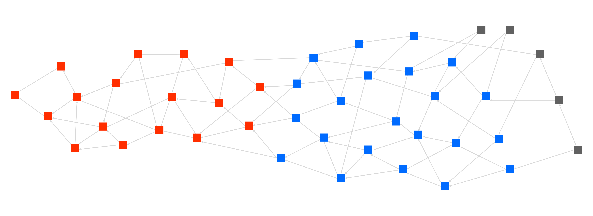
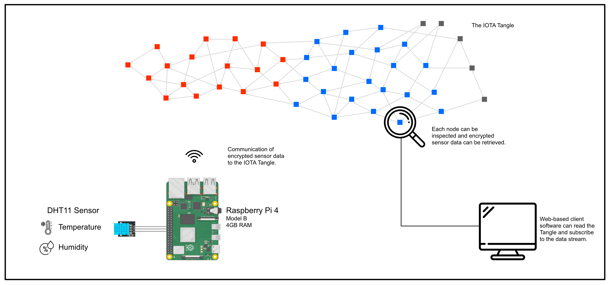

# Risk minimization in temperature-controlled supply chains through IOTA Tangle technology

### Jonas Wilinski  

#### Abstract:
With the rapidly increasing number of temperature-sensitive products, the need for a fully monitored supply chain is more important than ever. Currently, those involved must rely on container operators to communicate temperature deviations to the customer quickly and correctly.

#### Keywords:
Blockchain, IOTA, Supply Chain, Tangle  

## Introduction
This Concept Paper outlines a way of implementing state of the art Blockchain Technology onto a temperature-controlled supply chain in order to validate information and enable an active risk management. Therefore, a prototype will be set up using a Raspberry Pi 4 with an attached DHT11 temperature and humidity sensor to simulate a sensor inside a temperature-controlled sea-container. This Raspberry Pi will be integrated in a private Tangle using IOTA and pushes sensor data in an interval of 1 minute onto the tangle. This data will be encrypted and only visible to certain participants. The aim of the project is to have an operational prototype consisting of one or more Sensors (Raspberry Pi with DHT11) and a web dashboard to control the sensors and read their data. 

## IOTA and the Tangle
IOTA was founded in 2016 by David Sønstebø, Sergey Ivancheglo, Dominik Schiener and Serguei Popov. It emerged as a digital payment system also known as cryptocurrency. IOTA focusses mainly on the internet of things (IoT) mainly because of its advantage of not having any transaction fees. Therefore, micropayments and simple transactions can be made onto the tangle (IOTA’s blockchain) with not having to pay someone to validate it. This is possible because of the tangle’s unique implementation: it uses directed acyclic graphs in order to store the information and validate it whereas blockchain is using concatenated lists. In order to participate in this network, a participant simply needs to perform a small amount of computational work that verifies two previous transactions. This makes IOTA ideal for our use-case because of its lean characteristics and focus on IoT devices. Our chosen hardware, a Raspberry Pi 4 comes with plenty of computational power in order to send sensor data onto the tangle.

Moreover, without the need for monetary rewards, IOTA is not limited to transactional value settlements. It is possible to securely store information within Tangle transactions, or even spread larger amounts of information across multiple bundled or linked transactions.
This structure also enables high scalability of transactions. The more activity in the Tangle, the faster transactions can be confirmed. 

For this implementation, we are going to use IOTA’s Masked Authenticated Messaging (MAM) System. It enables us to encrypt data and stream it directly on the Tangle with some lines of code in JavaScript. Other devices like a monitoring system can then subscribe to the data stream through channels.

## The Prototype & Implementation

To start the process, a RaspberryPi will act as our edge-computing unit to gather and process temperature and humidity data from the DHT11 sensor. When this sensor data is collected, it is packed into a transaction and sent to our private IOTA Tangle. It gets a current time stamp and waits to be validated from other participants of our private tangle. The more sensor units participate, the faster the validation process will be. For testing purposes, the RaspberryPi will validate its own transactions.

Once in the Tangle, the sensor data is encrypted and cannot be modified in any way. To read the data, a key must be used in order to decrypt it. A web-based monitoring system is implemented in this concept.

The web-based client requires a valid login from an owner of sensor nodes. Once logged-in, the private key is uploaded to the system and sensor data is displayed.
On the technical perspective, it is as simple as a publisher / subscriber scenario. The sensor node publishes encrypted data constantly and populates the tangle with transactions. The web-based monitoring system subscribes to the tangle and receives the encrypted sensor data. Using the right key, temperature- and humidity data is being displayed in clear text or JSON Format in order to process it even more. A live graph can be drawn, and alerts can be set up to inform the user, whenever the cold-chain is being disrupted or a critical value is exceeded.

## Findings and Problems
Currently, this prototype is being built. This section will be populated in the process of development.

#### The Masked Authenticated Messaging (MAM) Protocoll
At first, we tried to implement the information flow with IOTA's MAM Protocoll. As it provides encrypted message channels and a publish/subscribe method, it is very well suited for our task at hand. But after much experimentation and implementation, MAM turned out to be very unstable and it even broke down on simple JSON formatted datafields. Especially retrieving data from the tangle to work with was very hard and didn't work well. 
To get it going, we therefore used Zero Value Transactions (ZVT) to write and read data to the tangle. This gives us the ability to also subscribe to a specific address and retrieve the temperature data. Moreover, it is validated on a higher level as it utilizes the standard IOTA transaction. 
Simultaniously, we are gathering information on IOTA Streams, which is a new framework for information flows, ultimately replacing MAM in some time. As it is currently written in RUST and does not have a standard API, it cannot be used in this example.

## Conclusion
TBC