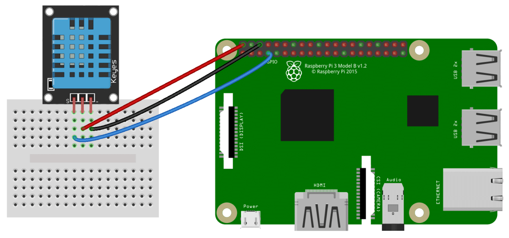

# The Raspberry Pi Prototype

The Raspberry Pi represents a edge-computing entity to collect sensor data and is capable of pushing data to the IOTA Tangle. Each Raspberry Pi can be installed inside a temperature-controlled container in order to collect sensor data and alert the clients.

## Prequisites:
- Raspberry Pi 4  Model B (4GB RAM)
- Raspberry Pi Official Power Brick
- 32GB microSD Card
- DHT11 Temperature & Humidity Sensor
- Working Internet Connection

# Getting Started

To get the Raspberry Pi up and running, follow the steps.
1. Copy Noobs on the 32GB microSD Card.
2. Select Raspbian Lite on the Pi and install it.
3. Let the Rasperry Pi boot up and activate SSL access in order to use PuTTY.
4. Run `sudo apt update`
4. Connect the DHT11 Sensor as shown in Figure 01.

 Figure 01: Connection of DHT11 Sensor with RaspberryPi

| DHT11 Sensor  | GPIO Raspberry Pi |
| ------------- |-------------------| 
| GND           | PIN 6 - GND       | 
| DATA          | PIN 7 - DATA      | 
| VCC           | PIN 2 - VCC (5V)  | 

5. Install NodeJS: 
Run the command `curl -sL https://deb.nodesource.com/setup_13.x | sudo -E bash -` to get the latest NodeJS Package. 
Then run `sudo apt-get install -y nodejs` to install it. 
Check your installed NodeJS version with `node -v`. If you get a valid version number, continue to Installation.

# Installation

In order to push sensor-data onto the tangle, you'll need some apps and dependencies.

1. Get the connection between the DHT11 Sensor and the Raspberry Pi working:  
Download the BCM2835 Library: 
`wget http://www.airspayce.com/mikem/bcm2835/bcm2835-1.63.tar.gz` 
Build and install bcm2835-1.56: 
Unzip the package: `tar zxvf bcm2835-1.63.tar.gz` 
Go into the folder: `cd bcm2835-1.63` 
Type: `./configure` 
Type: `make` 
Type: `sudo make check` 
Type: `sudo make install` 

2. Install Git on the Raspberry Pi: 
Type: `sudo apt install git`

3. Navigate to a suitable workplace (e.g. `\home\iota`).
4. Use `git clone xxx` to get the IOTA Code.
5. Navigate into `logu-iota\raspi_4`.
6. Run `npm-install`. It will install all necessary dependencies and set up the environment.

# Contents

The Github Repository consists of the following files:

- Folder: **client** 
All necessary scripts with an docker-image for the web-based client.
- Folder: **docs** 
Holds every documentation-file.
- Folder: **examples** 
Some basic JS-Files demonstrating the usage of IOTA's libraries.
- Folder: **raspi_4** 
All necessary scripts for the Raspberry Pi Prototype.
- File: **readme.md** 
GitHub's Readme File.

# Usage

After launching the script, the RaspberryPi will output a valid Root on the console. Keep that Root in mind, as we need it later to fetch our temperature data.
Additionally, a light web server is built up to access the pi without console access through HTTP Port 80.

